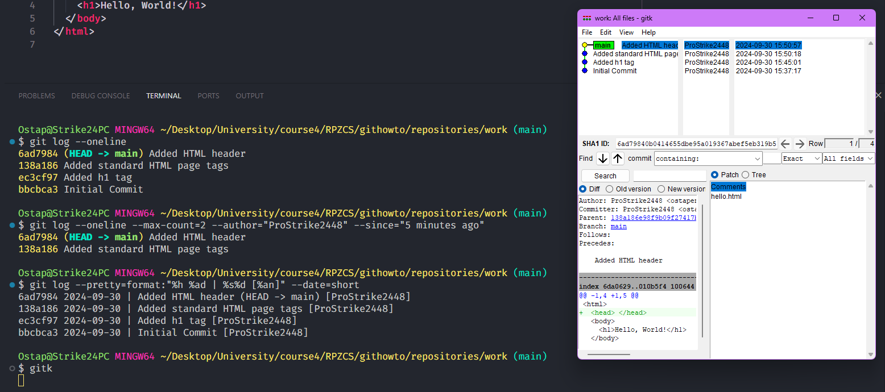
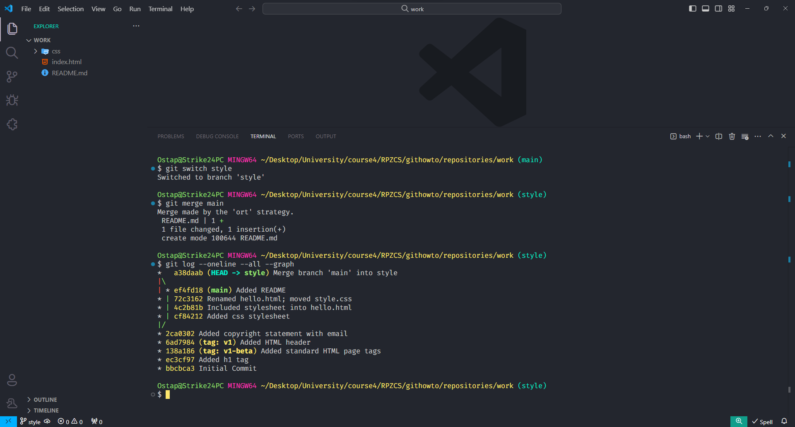
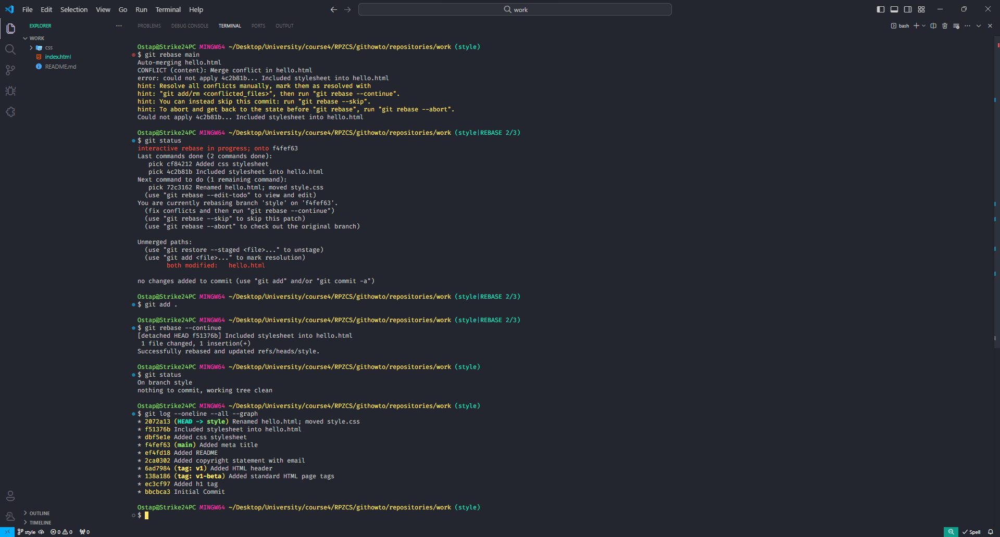

# learning-git

Опанування базових команд та принципів роботи з системою контролю версій Git, шляхом проходження
курсу на https://githowto.com

## 1. Git credentials


_<p align="center">Setting up name and email address</p>_


_<p align="center">Setting default branch name</p>_


_<p align="center">Line endings treatment on Windows</p>_

## 2. Creating a project


1. Create a “Hello, World!” page with `touch hello.html`
2. Create a repository using `git init`
3. Add the page to the repository using `git add` & `git commit`

## 3. Checking the status of the repository with `git status`

The command checks the status and reports that there’s nothing to commit, meaning the repository
stores the current state of the working directory, and there are no changes to record.


## 4. Making changes


_<p align="center">Changing the “Hello, World” page</p>_


_<p align="center">Checking the status after changes</p>_

## 5. Staging the changes with `git add`


Changes to the `hello.html` have been staged. This means that Git knows about the change, but it is
**not permanent** in the repository. The **next commit** will include the changes staged.

Should you decide not to commit the change, the status command will remind you that you can use the
`git reset` command to unstage these changes.

## 6. Staging and committing

Suppose you have edited three files (`a.html`, `b.html`, and `c.html`). After that you need to
commit all the changes so that the changes to `a.html` and `b.html` were a single commit, while the
changes to `c.html` were not logically associated with the first two files and were done in a
separate commit.

In theory, you can do the following:

```shell
git add a.html
git add b.html
git commit -m "Changes for a and b"
```

```shell
git add c.html
git commit -m "Unrelated change to c"
```

Separating staging and committing, you get the chance to easily customize what goes into a commit
and not confuse the person might be looking into this history later.

## 7. Committing the changes

The `commit` command allows interactively editing comments for the commit in the editor of your
choice (mine is VS Code), if you omit the `-m` flag from the command line.


_<p align="center">The working directory is clean, we can continue working</p>_

## 8. Changes, not files

Most version control systems work with files. You add the file to source control and the system
tracks changes from that moment on.

Git concentrates on the changes to a file, not the file itself. A `git add file` command does not
tell Git to add the file to the repository, but to note the current state of the file for it to be
committed later.


1. **First Change:** Adding default page tags (`<html>` and `<body>`)
2. Add this change
3. **Second change:** Add the HTML headers (`<head>` section)
4. Check the current status

   `hello.html` is listed in the status twice. The first change (the addition of default tags) is
   staged and ready for a commit. The second change (adding HTML headers) is unstaged. If we were
   making a commit right now, headers would not have been saved to the repository.

5. Commit
6. Adding the second change

   I've used the current directory (`.`) as the argument for the `add` command. This is the shortest
   and most convenient way to add all changes in the current directory. But since Git adds
   everything to the index, it's a good idea to check the state of the repository before running
   `add`, just to make sure you haven't added a file you shouldn't have.

7. Commit the second change

## 9. History

Getting a list of changes made is a function of the `git log` command.

You fully control what the log shows:

```shell
git log --oneline
git log --max-count=2
git log --since="5 minutes ago"
git log --until="5 minutes ago"
git log --author="Your Name"
git log --all
```

The ultimate format of the log:

```shell
git log --pretty=format:"%h %ad | %s%d [%an]" --date=short
```

- `--pretty="..."` defines the output format.
- `%h` is the abbreviated hash of the commit.
- `%ad` is the commit date.
- `|` is just a visual separator.
- `%s` is the comment.
- `%d` commit decorations (e.g. branch heads or tags).
- `%an` is the name of the author.
- `--date=short` keeps the date format short and nice.

Or use GUI-tools like `gitk` (for any platform)



## 10. Getting older versions

Git make time traveling possible, at least for your project. The `checkout` command will update your
working directory to any previous commit using its **hash** (first 7 characters are enough).


### `checkout` vs `switch`

> The `checkout` command has been a swiss army knife in the world of Git for a long time. It has
> tons of various options that let you run entirely different things: switch branches, reset code,
> etc. At some point, the Git team decided to split the command into several commands. The `switch`
> command is one of them — its sole purpose is to switch between branches. The `checkout` command is
> still available, but it is no longer recommended to use it for switching branches.

## 11. Tagging versions

For most people working with hashes directly is annoying at best. Wouldn't it be great if you could
label specific commits with human-readable names? This way you could clearly see important
milestones in the project history. Moreover, you could easily check out to a specific version of the
project by its name. For this reason, Git has a feature called "tags".

To create tag the version prior to the current version with the name v1-beta I will check out the
previous version. Instead of looking up the hash of the commit, I'm going to use the `^` notation,
specifically `v1^`, indicating the commit previous to `v1`.

> If the `v1^` notation gives any trouble, we can also try `v1~1`, which will reference the same
> version. The `V~N` notation means "the N-th version prior to V", or in case of `v1~1`, first
> version prior to `v1`.

You can check the available tags using the `git tag` command or in the log.


## 12. Discarding local changes (before staging)

Sometimes you have modified a file in your local working directory and you wish to just revert to
what has already been committed. The `checkout` command will handle that.

.png>)

1. Change `hello.html`
2. Check the status
3. Undo the changes in the working directory using `git checkout`

## 13. Cancel staged changes (before committing)

The `reset` command resets the staging area to `HEAD`. This clears the staging area from the changes
that we have just staged.

The `reset` command (default) does not change the working directory. Therefore, the working
directory still contains unwanted comments. We can use the `checkout` command from the previous
tutorial to remove unwanted changes from working directory.

.png>)

## 14. Cancelling commits

Sometimes you realize that the new commits are wrong, and you want to cancel them. There are several
ways to handle the issue, and I use the safest here.

To cancel the commit I'll create a new commit, cancelling the unwanted changes using `git revert`.


## 15. Removing a commit from a branch

`Revert` is a powerful command of the previous section that allows you to cancel any commits to the
repository. However, both original and cancelled commits are seen in the history of the branch (when
using `git log` command).

Often after a commit is already made, we realize it was a mistake. It would be nice to have an undo
command which allows the incorrect commit(s) to be immediately deleted. This command would prevent
the appearance of one or more unwanted commits in the `git log` history.

### The `reset` command

I have already used it to set the staging area to be consistent with a given commit (I used the
`HEAD` commit in previous section).

When you run the `reset` command along with a commit reference (`HEAD`, branch or tag name, commit
hash, etc.), the command will...

1. Point the current branch to the specified commit.
2. Optionally reset the staging area so it will comply with the specified commit.
3. Optionally reset the working directory so it will match the specified commit.


What happened to the wrong commits? They are still in the repository. Actually, we can still refer
to them using `git add --all`.

Resets on local branches are usually harmless. The consequences of any "accident" can be reverted by
using the proper commit.

However, other users sharing the branch can be confused if the branch is shared on remote
repositories.

## 16. Removing the `oops` tag

The `oops` tag has performed its function. Let me remove that tag and permit the garbage collector
to delete referenced commit.


The `oops` tag will no longer appear in the repository.

## 17. Amending commits using `git commit --amend`


The new commit replaces the original commit. The same effect can be achieved by resetting the last
commit in the branch, and recommitting new changes.

## 18. Creating a branch

Developing a new feature is always risky: it may take a while, you might want to cancel it in the
end, etc. For this reason, it is best to isolate feature development in a separate branch. When the
feature is ready, you can merge that branch into the `main` branch. Until then, your `main` is kept
safe from risky and untested code. Moreover, you can work on multiple features in parallel, each in
its own branch. You can also commit to `main` at any time, for example, to fix a bug.


1. [Create a branch](#checkout-vs-switch)
2. Add the `style.css` file
3. Change `hello.html` to use `style.css`

## 19. Switching branches using `git switch`


## 20. Moving files using


1. Examining the history of changes in a specific file using `git log file`
2. Comparing different versions of a specific file using `git show`
3. Renaming hello.html using `mv`

   Git interprets this modification as if I've deleted the file and created a new one. This is a red
   flag. We need to inform Git that we've renamed the file, not deleted and created a new one. In
   straightforward cases, Git will deduce that the file has been renamed as soon as we add the file
   to the index.


4. Safely moving `style.css`

   In most operating systems, renaming and moving files are essentially the same operation. So,
   let's move my `style.css` file to the css directory. This time, however, I'll use the `git mv`
   command to ensure the move is recorded in Git's history as a move, not as a deletion and addition
   of a new file.

## 21. Changes in the `main` branch


_<p align="center">Add `README.md` to `main` branch</p>_

## 22. Viewing diverging branches


The `--all` flag guarantees that we see all the branches. By default, only the current branch is
displayed.

The `--graph` option adds a simple commit tree represented with basic text lines. We see both
branches (style and main) and that the branch `main` is marked as `HEAD`, meaning that it's current.
The common ancestor to both branches is the branch where the "Added copyright statement with email"
commit has been introduced.

## 23. Merging



Through periodic `main` branch merging with the `style` branch you can pick up any changes or
modifications to the `main` to maintain compatibility with the `style` changes in the mainline.

However, it does produce ugly commit graphs.

## 24. Creating a merge conflict

When you merge two branches, Git tries to move the changes from one branch to the other. If the same
part of the file was changed in both branches, Git may not be able to combine the changes
automatically. In this case, Git will report a conflict and ask you to resolve it manually.


After the "Added README" commit, the `main` branch has been merged with the `style` branch, but
there is an additional `main` commit, which was not merged back to the `style` branch.

## 25. Resolving conflicts


Jumping straight to the conflict resolution may not be a best strategy. The conflict may be caused
by the changes we are unaware of. Or the changes are to.o significant to address right away For this
reason, Git allows us to abort the merge and return to the state before the merge. To do that, we
can use the `git merge --abort` command, as suggested by `status` command.


To resolve the conflict, we need to edit the file to the state we're happy with and then commit it
as usual. In my case, I will combine the changes from both branches.


## 26. `rebase` vs `merge`

Use the `rebase` command:

- When you fetch changes from a remote repository and want to apply them to your local branch.
- If you want to keep the commit history linear and easy to read.

Don't use the rebase command:

- If the current branch is public and shared. Rewriting such branches will hinder the work of other
  team members.
- When the exact commit branch history is important (because the rebase command rewrites the history
  of commits).

Given the above recommendations, use `rebase` for short-term, local branches and the `merge` command
for branches in the public repository.

## 27. Resetting the `style` branch

To look at the differences between rebasing and merging, I need to get back into the repository at
the time prior to the first merge, and then repeat the same steps but using relocating instead of
merging. I can `reset` the branch to any commit. In fact, the `reset` command can change the branch
pointer to point to any commit in the tree. To reference that commit, we either use its hash, or
deduct that this commit is 2 commits before the `HEAD`, or `HEAD~2` in Git notation.


## 28. Rebase

There are two commits that are in the `main` branch, but not in the `style` branch: the new `README`
file and that conflicting change in the `index.html` file. This time, I will move these changes to
the `style` branch using the `rebase` command rather than `merge`.

When merging, we would have a "reverse" conflict. During the merge, the changes of the `main` branch
are applied on top of the `style` branch.



The result of the `rebase` command looks much like that of the `merge` command. The `style` branch
currently contains all its changes, plus all the changes of the `main` branch. The commit tree,
however, is a bit different. The `style` branch commit tree has been rewritten to make the `main`
branch a part of the commit history. This makes the chain of commits linear and more readable.

## 29. Merging to the main branch


## 30. Cloning repositories


## 31. Examine the cloned repository


We see a main branch (`HEAD`) in the history. We can also find **remote branches** with strange
names (`origin/main`, `origin/style` and `origin/HEAD`).

## 32. What is origin?


The `origin` of the remote repository is the original `work` repo. Remote repos are typically stored
on a separate machine or a centralized server. However, as we see, they can also point to a
repository on the same machine. There is nothing so special about the name `origin`, but there is a
convention to use it for the primary centralized repository (if any).

## 33. Remote branches


Git lists all the branches from the original repo, but the remote repository branches are not
treated as local ones. If we need our own **style** branch, we need to create it on our own.

## 34. Changing the original repository


## 35. Fetching changes


`git fetch` command will fetch new commits from the remote repo, but won't merge them into the local
branches (the cloned `README` file has not been changed).

## 36. Merging pulled changes


The `fetch` command gives precise control over what is pulled and merged, but for convenience, there
is also a command `pull` which fetches and merges changes from the remote branch into current branch
with one call.

## 37. Adding a tracking branch

I don't have a style branch anymore, but Git knows that it was in the original repository.


Now the `style` branch in the branch list and log.

## 38. Bare repos

A bare repository is a repository that doesn't have a working directory. It only contains the .git
directory, the directory in which Git stores all its internal data. The main purpose of these
repositories is to be a central repository that developers can push to and pull from, so there's no
need in having a working directory. Bare repositories are also used in Git hosting services like
GitHub and GitLab.


The convention is that repositories ending in `.git` are bare repositories. We can see that there is
no working directory in the `work.git` repo. Essentially it is nothing but the `.git` directory of a
regular repo.

## 39. Adding a remote repository


## 40. Pushing changes

Since bare repositories are usually shared on some sort of network server, it is usually difficult
to cd into the repo and pull changes. So we need to push our changes into other repositories.


The _shared repository_ is the one receiving changes.

## 41. Pulling shared changes


## 42. Hosting your Git repository


> [!WARNING]  
> This server does not perform authentication, so anyone can push changes to repository.
